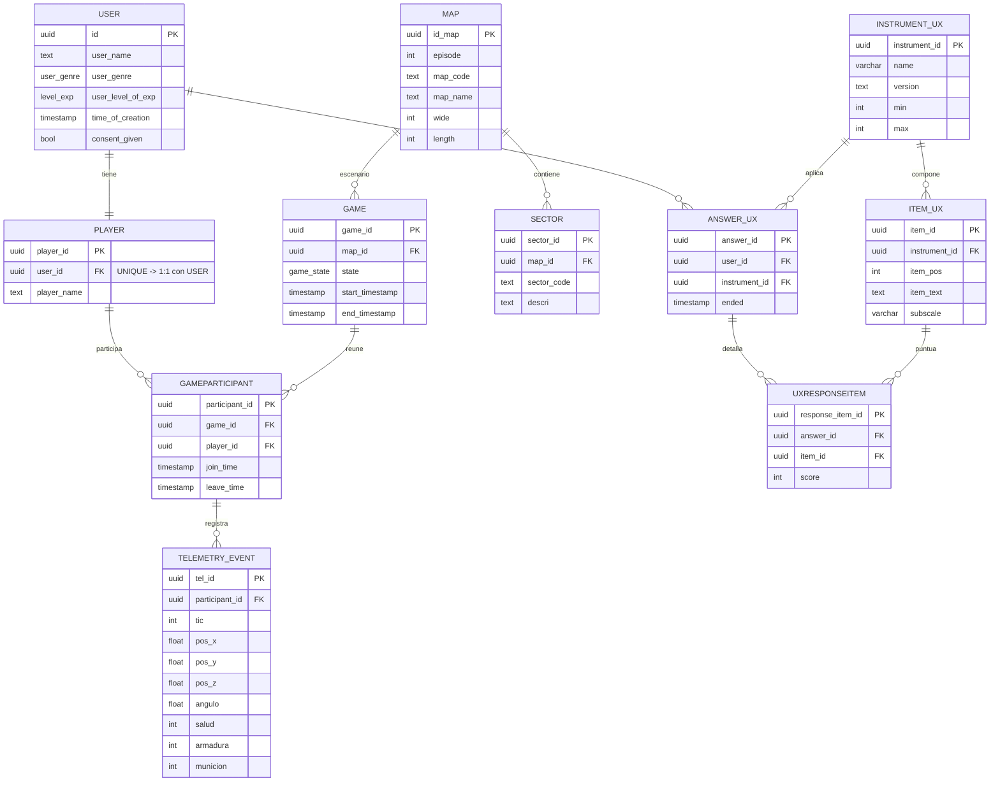

# Diagrama Entidad-Relacion — Chocolate-Doom Telemetry & UX

GitHub renderiza este diagrama automaticamente al abrir el archivo.

## Notas de cardinalidad
- `USER 1—1 PLAYER`: cada usuario tiene un unico perfil de jugador (`UNIQUE(user_id)` en Player).
- `MAP 1—N SECTOR` y `MAP 1—N GAME`: un mapa agrupa muchos sectores y se juega en muchas partidas.
- `GAME 1—N GAMEPARTICIPANT` y `PLAYER 1—N GAMEPARTICIPANT`: tabla puente partida↔jugador (`UNIQUE(game_id, player_id)`).
- `GAMEPARTICIPANT 1—N TELEMETRY_EVENT`: cada participacion genera muchos eventos (`UNIQUE(participant_id, tic)` evita duplicados).
- `SECTOR` ya **no** se conecta con `TELEMETRY_EVENT`. El "sector" para el analisis de hotspots (Q5) es una celda 250x250 calculada desde `pos_x`/`pos_y`; `SECTOR` queda como catalogo de geografia estatica ligado solo a `MAP`.
- Bloque UX: `INSTRUMENT_UX 1—N ITEM_UX`, `INSTRUMENT_UX 1—N ANSWER_UX`, y `UXRESPONSEITEM` cruza `ANSWER_UX` con `ITEM_UX` (`UNIQUE(answer_id, item_id)`).
